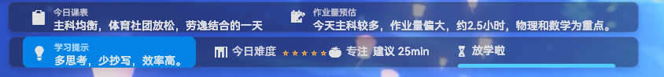

# AIIsland/AISmartClass
> [ClassIsland](https://github.com/ClassIsland/ClassIsland) 插件 — 为你的校园课表注入 AI 智能 ✨
>
> 程序集名 / 插件 ID：`ClassIsland.AISmartClass`　·　显示名称：**AIIsland**

> ⚠️ **本插件的全部代码均由 AI（大语言模型）编写生成。**
> 作者负责需求设计、调试验证与发布，具体实现代码由 AI 辅助完成。使用前请自行评估代码质量与安全性。

---

## 关于名称

| 场景 | 名称 |
|------|------|
| 用户可见显示名（插件列表、组件库、设置页） | **AIIsland** |
| 技术标识符（程序集名、命名空间、插件 ID、DLL 文件名） | `ClassIsland.AISmartClass` |

> 早期开发代号为 `AISmartClass`，后统一更名为 **AIIsland**。为避免破坏 `using` 引用、`avares://` 资源路径和 manifest 入口指向，技术标识符仍保留 `ClassIsland.AISmartClass`，仅更改对用户展示的名称。两者指向同一个插件。

## 目前已实现的功能
### 提醒
| 功能 | 触发时机 | 说明 |
|---|---|---|
| 课前提醒 | 课间开始时 | AI 根据刚上完的课 + 下节课科目生成个性化全屏提醒 |
| 放学总结 | 放学时 | AI 生成本日学习总结全屏遮罩，含复习建议 |
| 换课提醒 | 检测到临时换课时 | 自动弹出提示告知课表变动 |
| 语音播报 | 随提醒触发	 | 可选开启，默认关闭以免影响课堂 |

支持 AI 离线降级：API 不可用时自动回退到本地预设句子库

换课提醒无 AI 调用，直接弹提示
### 组件
| 组件 |	显示名 | 功能 |
|----|----|----|
|ScheduleInsight |	AIIsland 课表总结 |	AI 生成一句话解读今日课表|
|HomeworkEstimate | AIIsland 作业量估算 | 根据科目类型估算今日作业量（AI + 规则兜底）|
|ClassCountdown | 课时倒计时 | 当前课时剩余时间 + 进度条，实时刷新|
|CurrentHint | AIIsland 课程提示 | 每次上课自动生成当前课程学习提示，换课自动更新|
|DifficultyInfo | 难度与番茄钟 | 今日课程难度星数+ 专注时长建议|

### 功能展示
* 课前提醒

* 放学总结

* 换课提醒

* 组件

## 一些未来的计划 ~~画饼~~ 
* 语音播报优化：
    * 目前此功能尚不稳定，尽量不要使用    
    * 在未来我们将适配花儿不哭大佬的GPT-SoVITS在线推理api
* 推出欢迎向导帮助上手本插件
* 考试模式

本项目使用了鸿蒙系统内的图标，非常感谢！！！

本插件在 ClassIsland 插件 SDK 的开源许可（**LGPLv3**）下分发。

# 附录 
# AIIsland API 提供商配置指南

> 本指南列出 AIIsland 支持的所有 AI API 提供商，并附注册、获取 Key 和配置教程。
> 更新于 2026 年 6 月 16 日。

---

## ⚠️ 重要通知：阿里云百炼 qwen-turbo 即将下线

阿里云已公告：**qwen-turbo 将于 2026 年 7 月 13 日起下线**，届时调用将出现超时/失败/无返回。请尽快迁移至 **Qwen3.6 / Qwen3.7 系列**（推荐 `qwen/qwen3.6-flash`）。

---

## 提供商总览

| 提供商 | 推荐模型 | API 地址 | 注册/控制台 | 月成本（约） | 特点 |
|--------|---------|---------|------------|------------|------|
| **DeepSeek** | deepseek-v4-flash | `https://api.deepseek.com/v1/chat/completions` | [platform.deepseek.com](https://platform.deepseek.com) | ¥0.12 | 最新 V4 模型，当前性价比最高 |
| **阿里云百炼** | qwen/qwen3.6-flash | `https://dashscope.aliyuncs.com/compatible-mode/v1/chat/completions` | [bailian.console.aliyun.com](https://bailian.console.aliyun.com) | ¥0.30 | Qwen3.6 系列，新用户赠 100 万 token（90 天） |
| **硅基流动** | Qwen2.5-72B-Instruct（免费） | `https://api.siliconflow.cn/v1/chat/completions` | [siliconflow.cn](https://siliconflow.cn) | ¥0（免费） | 每月 200 万 token 免费额度 |
| **OpenAI** | gpt-4.1-nano | `https://api.openai.com/v1/chat/completions` | [platform.openai.com](https://platform.openai.com) | ≈¥0.14 | 最新 nano 模型，最便宜 OpenAI 方案 |
| **Ollama（本地）** | 任意本地模型 | `http://localhost:11434/v1/chat/completions` | [ollama.com](https://ollama.com) | ¥0 | 完全免费，需自备电脑跑模型 |

---

## 成本明细

### 用量假设

| 参数 | 值 |
|------|-----|
| 每日上课节数 | 6–8 节 |
| 每日课间次数 | 5–7 次 |
| 每日 AI 调用量 | ≈ 15 次（课前提醒 ×7 + 放学总结 ×1 + 课表总结 ×1 + 作业估算 ×1 + 课程提示 ×5） |
| 每次调用 Token | ≈ 300 tokens（系统提示约 200 + AI 输出约 100） |
| 每日 Token 总量 | ≈ 4500 tokens（15 次 × 300） |
| 每月上课天数 | 20 天 |
| 每月 Token 总量 | ≈ 9 万 tokens（4500 × 20），其中输入 ≈ 6 万，输出 ≈ 3 万 |

### 各提供商详细价格

| 提供商 | 模型 | 输入价格（每百万 token） | 输出价格（每百万 token） | 单次调用 | 日成本 | 月成本 | 年成本 |
|--------|------|-------|-------|---------|--------|--------|--------|
| DeepSeek | deepseek-v4-flash | ¥1 | ¥2 | ¥0.0004 | ¥0.006 | ¥0.12 | ¥1.44 |
| 阿里云百炼 | qwen/qwen3.6-flash | ¥1.30 | ¥7.50 | ¥0.0005 | ¥0.0075 | ¥0.30* | ¥3.64* |
| 硅基流动 | Qwen3.5-4B | ¥0 | ¥0 | ¥0 | ¥0 | ¥0 | ¥0 |
| OpenAI | gpt-4.1-nano | $0.10 | $0.40 | $0.00005 | $0.00075 | $0.015 | $0.18 |
| Ollama | 本地 | — | — | ¥0 | ¥0 | ¥0 | ¥0 |

> \* 阿里云百炼新用户每个模型赠送 100 万 token（有效期 90 天）。AIIsland 月均约 9 万 token，免费额度可用约 11 个月；额度用完或过期后按上表计费。硅基流动 Qwen2.5-72B 每月 200 万 token 免费额度，AIIsland 完全够用。

### 💡 性价比推荐

| 排名 | 方案 | 月成本 | 推荐理由 |
|------|------|--------|---------|
| 🥇 | 硅基流动 Qwen3.5-4B（免费） | ¥0 | 免费额度完全覆盖，中文效果好 |
| 🥈 | DeepSeek V4 Flash | ¥0.12 | 最新模型、性能强、价格最低的付费方案 |
| 🥉 | 阿里云百炼 Qwen3.6-Flash | ¥0.30 | 免费额度用完后比 DeepSeek 稍贵，但注册方便 |

---

## 阿里云百炼完整教程

> ⚠️ 旧模型 `qwen-turbo` 将于 **2026 年 7 月 13 日**下线，请改用 `qwen/qwen3.6-flash`。

### 第 1 步：注册阿里云账号

1. 打开 [阿里云官网](https://www.aliyun.com)
2. 点击右上角「免费注册」
3. 用手机号注册并完成**实名认证**（阿里云调用 API 需实名，个人支付宝/身份证认证即可）

### 第 2 步：开通百炼服务

1. 打开 [百炼控制台](https://bailian.console.aliyun.com)
2. 首次进入会提示开通服务，点击「立即开通」
3. 同意协议，等待开通完成（约 10 秒）
4. 开通后自动获得每模型 100 万 token 免费额度

### 第 3 步：获取 API Key

1. 在百炼控制台右上角，鼠标移到头像 → 点击「API-KEY」
2. 点击「创建我的 API Key」
3. 选择业务空间（默认 default 即可），输入描述（如 `AIIsland`），点击确定
4. **立即复制并保存 API Key**（以 `sk-` 开头；关闭后无法再次查看完整值，只能删了重建）

### 第 4 步：在 AIIsland 中配置

1. 打开 ClassIsland → 应用设置 → **AIIsland** 设置页
2. 填入以下信息：

| 字段 | 填入值 |
|------|--------|
| API 地址 | `https://dashscope.aliyuncs.com/compatible-mode/v1/chat/completions` |
| API Key | 第 3 步获取的 Key（以 `sk-` 开头） |
| 模型名称 | `qwen/qwen3.6-flash` |

3. 点击「保存配置」
4. 点击「测试 API 连接」确认配置成功（也可用「测试 AI 提醒」「测试 AI 总结」验证实际效果）

### 第 5 步：切换模型（可选）

百炼平台支持多种模型，修改 `模型名称` 字段即可切换：

| 模型 | 模型名称 | 定位 | 输入/输出价格（元/百万 token） |
|------|---------|------|--------------------------|
| Qwen3.6-Flash ⭐ | `qwen/qwen3.6-flash` | 速度最快、成本最低 | ¥1.30 / ¥7.50 |
| Qwen3.6-Plus | `qwen/qwen3.6-plus` | 均衡性能 | 略高于 Flash |
| Qwen3.7-Plus | `qwen/qwen3.7-plus` | 最新版本，更强推理 | 略高于 3.6 |
| Qwen3.7-Max | `qwen/qwen3.7-max` | 旗舰模型，最强性能 | 价格最高 |
| DeepSeek-V3（百炼版） | `deepseek-v3` | 百炼平台直接调 DeepSeek V3 | — |

> 切换模型只需改「模型名称」字段，API 地址和 Key 不变。以上为官方推荐迁移替代模型。具体可用模型以百炼控制台「模型广场」为准。

### 免费额度说明

阿里云百炼为新用户每个模型赠送 **100 万 token**，有效期 **90 天**（开通百炼服务后自动发放）。

AIIsland 月均约 9 万 token，100 万额度可用约 11 个月。额度用完或过期后按正常价格计费（Qwen3.6-Flash 月成本约 ¥0.30）。

---

## 其他提供商快速指南

### DeepSeek（最新 V4 系列）

DeepSeek 已于 2026 年发布 V4 系列，旧模型 `deepseek-chat` / `deepseek-reasoner` 将于 **2026 年 7 月 24 日** 弃用。

1. 打开 [platform.deepseek.com](https://platform.deepseek.com)
2. 手机号注册（中国手机号即可）
3. 右上角「API Keys」→ 创建 Key
4. AIIsland 配置：

| 字段 | 填入值 |
|------|--------|
| API 地址 | `https://api.deepseek.com/v1/chat/completions` |
| API Key | 你的 Key（以 `sk-` 开头） |
| 模型名称 | `deepseek-v4-flash`（推荐）或 `deepseek-v4-pro` |

> **模型选择**：`deepseek-v4-flash`（¥1/¥2 每百万 token）性价比最高，适合日常提醒；`deepseek-v4-pro`（¥3/¥6）效果更强。两者均支持 100 万 token 上下文。充值 ¥10 够用数年。

### 硅基流动（免费）

1. 打开 [siliconflow.cn](https://siliconflow.cn)
2. 手机号注册并完成实名认证
3. 控制台 → API 密钥 → 新建
4. AIIsland 配置：

| 字段 | 填入值 |
|------|--------|
| API 地址 | `https://api.siliconflow.cn/v1/chat/completions` |
| API Key | 你的 Key（以 `sk-` 开头） |
| 模型名称 | `Qwen/Qwen2.5-72B-Instruct`（免费，每月 200 万 token） |

> 也可用 `deepseek-ai/DeepSeek-V3`（免费，每月 100 万 token）。注意硅基流动的模型名必须带完整路径（如 `Qwen/Qwen2.5-72B-Instruct`）。免费额度按月重置，完全覆盖 AIIsland 用量。

### OpenAI

1. 打开 [platform.openai.com](https://platform.openai.com)
2. 注册（需境外手机号 + 外币信用卡）
3. Dashboard → API Keys → Create
4. AIIsland 配置：

| 字段 | 填入值 |
|------|--------|
| API 地址 | `https://api.openai.com/v1/chat/completions` |
| API Key | 你的 Key（以 `sk-` 开头） |
| 模型名称 | `gpt-4.1-nano`（最便宜）或 `gpt-4o-mini` |

> **模型选择**：2026 年新增 `gpt-4.1-nano`（$0.10/$0.40 每百万 token），比 gpt-4o-mini 更便宜。

### Ollama（本地部署）

1. 下载 [ollama.com](https://ollama.com) 并安装
2. 终端运行：`ollama pull qwen2.5:7b`
3. AIIsland 配置：

| 字段 | 填入值 |
|------|--------|
| API 地址 | `http://localhost:11434/v1/chat/completions` |
| API Key | 留空 |
| 模型名称 | `qwen2.5:7b` |

> 完全免费、离线可用，但需要一台有显卡的电脑。

---

## 常见问题

**Q：API Key 填错了怎么办？**
直接改新 Key 保存即可，AIIsland 会实时同步。

**Q：怎么知道 AI 有没有在正常工作？**
在 AIIsland 设置页点击「测试 API 连接」「测试 AI 提醒」或「测试 AI 总结」按钮，看到返回结果即正常。

**Q：API 调用失败了会怎样？**
AIIsland 会自动降级到本地的预设句子库，提醒不会丢失，用户无感知。

**Q：可以用多个提供商吗？**
目前 AIIsland 只支持一个 API 配置，但可以随时切换——改地址和 Key 保存即可。

**Q：qwen-turbo 下线后我该怎么办？**
在 AIIsland 设置页把「模型名称」从 `qwen-turbo` 改为 `qwen/qwen3.6-flash`，保存即可。其他字段不变。

---

*本指南由 AI 编写 · 适用于 AIIsland v1.0.0.0*
